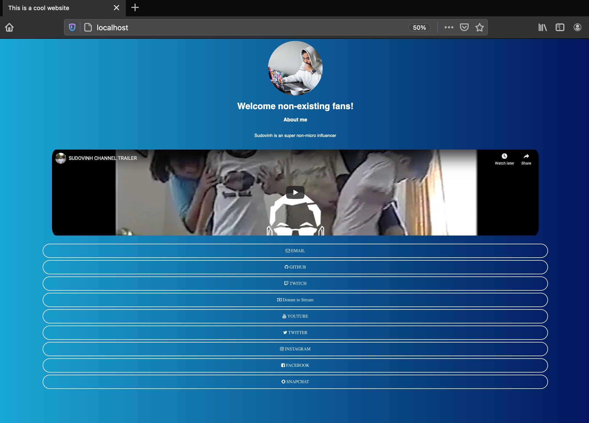

# Docker - Social Landing Page
Docker container running nginx website that is a social media landing page similar to linktree, ContactInBio, Shorby, Lnk, Tab, blah, etc (there is so many out there).

## What does it look like?

It's plain and simple.



# Usage
You have the following environment variables which allow you to configure the
social landing page:

| Variable name | Description  | Default | Example |
| --- | ---| ---| ---|
| DOMAIN | Domain name  | `none` | DOMAIN="awesome-website"
| META_DESCRIPTION | Meta description | `none` | META_DESCRIPTION="This website is all about awesome"
| META_TITLE | Meta title | `none` | META_TITLE="AWESOME WEBSITE | AWESOME STUFF"
| TITLE | Webpage head title | `TEST TITLE` | TITLE="AWESOME WEBSITE"
| FAVICON_IMG_URL | Favicon image url | `none` | FAVICON_IMG_URL="https://myfaviconsudovinh.com/favicon.png"
| SUB_TITLE | Subtitle | `This is a sub title.` | SUB_TITLE="THIS AWESOME SITE"
| ABOUT_ME | A about me section | `none` | ABOUT_ME="This is an awesome website with awesome things."
| PROFILE_IMG_URL | A profile image above the sub title | `none` | PROFILE_IMG_URL="https://pbs.twimg.com/profile_images/1274630142405427200/ethb5B1m_400x400.jpg"
| TWITCH_URL | Twitch profile url | `none` | TWITCH_URL="https://www.twitch.tv/psychopoptart"
| EXTRA_BUTTON_NAME | Extra button name | `none` | EXTRA_BUTTON_NAME="Stream Donation"
| EXTRA_FONT_ICON | Extra css font icon. https://fontawesome.com/v4.7/icons/ ex. "fa-money" | `none` | EXTRA_FONT_ICON="fa-money"
| EXTRA_URL | Extra button url | `none` | EXTRA_URL="https://streamlabs.com/psychopoptart1"
| YOUTUBE_VIDEO_URL | A embed youtube video above the links button | `https://www.youtube.com/embed/VYOjWnS4cMY` | YOUTUBE_VIDEO_URL="https://www.youtube.com/embed/VYOjWnS4cMY"
| YOUTUBE_URL | Youtube profile button url | `none` | YOUTUBE_URL="https://www.youtube.com/channel/UC20LoHy2mX0LQODrkUalxVQ"
| TWITTER_URL | Twitter profile button url | `none` | TWITTER_URL="https://www.twitter.com/iamcool" 
| FACEBOOK_URL | Facebook profile button url | `none` | FACEBOOK_URL="https://www.facebook.com/iamcool" |
| INSTAGRAM_URL | Instagram profile button url | `none` | INSTAGRAM_URL="https://www.instagram.com/iamcool"
| SNAPCHAT_URL | Snapchat profile button url | `none` | SNAPCHAT_URL="https://www.snapchat.com/iamcool"
| GITHUB_URL | Github profile button url | `none` | GITHUB_URL="https://www.github.com/iamcool"
| EMAIL  | Email to be used for the email button | `none` | EMAIL="iamcool@awesome-website.com"

# Getting Started
## Build docker image locally
```bash
docker build -t local-social-landing-page .
```

## Run locally
```bash
docker run --rm -d -p 80:80 \
-e DOMAIN='sudovinh' \
-e META_DESCRIPTION='This is sudovinh notlinktree social landing page.' \
-e META_TITLE='sudovinh' \
-e TITLE='This is a cool website' \
-e SUB_TITLE='Welcome non-existing fans!' \
-e FAVICON_IMG_URL='https://github.com/sudovinh/docker-social-landing-page/blob/main/src/images/sudovinh/sv-512.png' \
-e ABOUT_ME='Sudovinh is an super non-micro influencer' \
-e PROFILE_IMG_URL='https://pbs.twimg.com/profile_images/1274630142405427200/ethb5B1m_400x400.jpg' \
-e EXTRA_BUTTON_NAME='Donate to Stream' \
-e EXTRA_FONT_ICON='fa-money' \
-e EXTRA_URL='https://streamlabs.com/psychopoptart1/tip' \
-e TWITCH_URL='https://www.twitch.tv/psychopoptart' \
-e YOUTUBE_VIDEO_URL='https://www.youtube.com/embed/7zil-zsn-a4?autoplay=1&mute=1' \
-e YOUTUBE_URL='https://www.youtube.com/channel/UCdupcYF7zU4SlK7S1sI1vvQ' \
-e TWITTER_URL='https://twitter.com/sudovinh' \
-e FACEBOOK_URL='https://www.facebook.com/sudovinh/' \
-e INSTAGRAM_URL='https://www.instagram.com/sudovinh/' \
-e SNAPCHAT_URL='https://www.snapchat.com/add/djvinhii' \
-e GITHUB_URL='https://github.com/sudovinh' \
-e EMAIL='thisiscool@sudovinh.com' \
--name testpage local-social-landing-page:latest
```

## Accessing the page locally
Go to your browser then type the following in the url:
```bash
localhost:80
```

## Example
www.sudovinh.com
www.psychopoptart.com

# CI/CD Docker Image
Using github actions to build `Dockerfile` and test if the container can be curled after running.
- dockerhub: https://hub.docker.com/r/sudovinh/social-landing-page
- docker pull image command: `docker pull sudovinh/social-landing-page`
